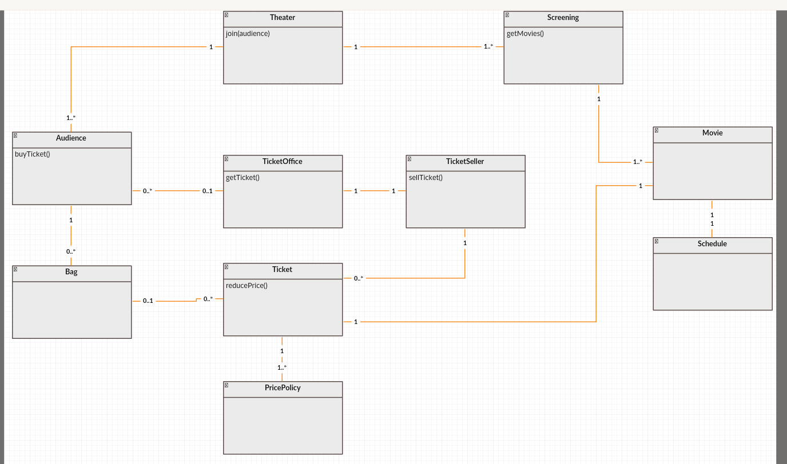

# 객체지향 설계 연습 - 1
영화관 시스템 구축으로 객체지향 설계 연습

## 시나리오
1. 영화관입장
2. 관람객이 티켓오피스한테 티켓 구매
3. 티켓오피스는 티켓셀러와 관람객을 이어줌
4. 티켓셀러는 남은 티켓정보 & 관람객 정보로 티켓(할인)된거 판매함
5. 티켓에는 영화 정보가 있고, 영화 정보에는 상영관과 스케쥴 정보가 있음
6. 관람객은 티켓을 샀으니 극장에서 상영관을 찾아가서 영화관람함

## 도메인 설계 UML

